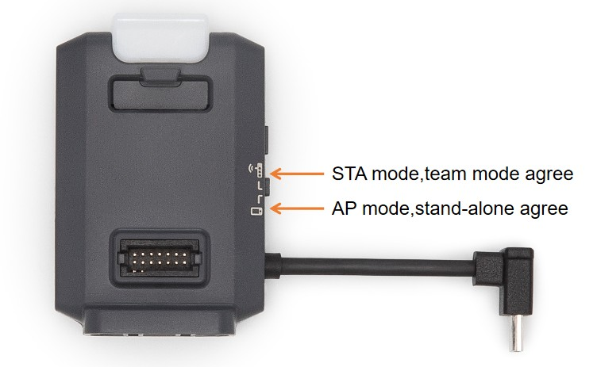
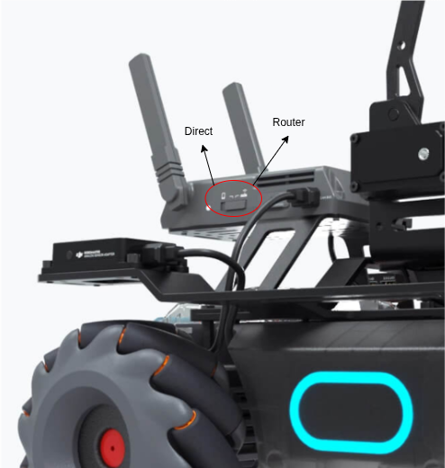

.. _howtos:

How To
======

Setup Wi-Fi for RMTT and RMEP
-----------------------------

All the drones and robots are tested with 2.4 GHz Wi-Fi network. 
It is advisible to assign static IPs to the RMTT drones and RMEP robots using the router settings and label the robots and drones with their IPs for ease of use. 
If dynamic IP are used, enable `random_assign` option in the `robomaster_server.yaml` file.

Use the `setup_wifi.yaml` file to setup the configuration required.

Drones:

Connect the external module to the RMTT drones, switch the connection mode to **direct** (AP mode) connection and power on all the drones.

Robots:

Turn on the robots and switch the connection mode to **router** connection.

Once all the drones and robots are powered on, run the following command.

.. code-block:: bash

    source install/setup.bash
    ros2 launch robomaster_ros2 setup_wifi.launch.py

This will connect your PC to the RMTT drones one by one and excecute the necessary commands to set up the Wi-Fi connection. 

The QR code will be displayed on seperate window. press the red/white small button on the side of the robot's connection switch and scan it using the robot's camera to connect the robot to the Wi-Fi network.

Once the setup is done, drones need turn off and switch to the **router** (STA mode) connection mode.
Now when the drones are powered on, they will connect to the Wi-Fi network and propeller will start spinning at low speed. This indicates the connection is successful. (It can take couple of minutes)

.. tip:: 
    You can flip the drone >90° to stop the propellers.

.. note::
    This setup procedure is generally only required once. If a drone or robot is unable to connect to the network, repeat the setup process for the specific robot/drone.

Start the robomaster server
---------------------------

Once all the drones, robots and PC are connected to the Wi-Fi network, robomaster server can be started.

Check the `rmtt_param.yaml` and `rmep_param.yaml` files to ensure the parameters are set correctly for the drones and robots.

Check the `robomaster_server.yaml` file to ensure the local IP, number of drones and robots are set correctly.

.. code-block:: bash

    source install/setup.bash
    ros2 launch robomaster_ros2 robomaster_server.launch.py

Camera feeds
------------

Set ``pub_cam: True`` in each robot's entry in ``rmtt_param.yaml`` or
``rmep_param.yaml``. Camera frames are published as ``sensor_msgs/Image`` on
``/<robot_name>/image``.

The RMTT multi-drone defaults use high camera FPS with 480p video at 2 Mbit/s.
Install ``python3-av`` before enabling a camera. Video decoding uses PyAV rather
than DJI's legacy ``libmedia_codec`` H.264 wrapper, which is not safe with the
current Ubuntu/FFmpeg combination. ``libmedia_codec`` is needed only for EP
audio decoding.
This avoids saturating a 2.4 GHz access point and avoids repeatedly
serializing stale 720p frames. Increase bitrate and resolution only after
checking all feeds together.

The EP/Core feed follows DJI's SDK sequence and connects to the robot's TCP
video port 40921. Its supported resolutions are ``360p``, ``540p``, and
``720p``.

EP chassis and gimbal telemetry
-------------------------------

Set ``pub_position: True`` under ``rmep`` in ``rmep_param.yaml`` to publish
``geometry_msgs/PoseStamped`` on ``/<robot_name>/position`` at 10 Hz. Position
is published in ``pose.position`` and orientation is published in
``pose.orientation`` as a quaternion computed from chassis attitude.

Set ``pub_gimbal_angle: True`` to publish
``robomaster_interface/msg/GimbalAngle`` on ``/<robot_name>/gimbal_angle`` at
10 Hz. This topic is available only when the connected robot has the EP/S1
gimbal. EP Core robots without a gimbal log a warning and do not create the
topic.

LED controls
------------

EP/S1 robots with a gimbal provide selective gimbal armor and blaster LED
services. RGB channels follow DJI's 0--255 range (the alpha channel is
ignored), and gimbal LED indices are 0--7. An empty ``led_list`` selects DJI's
default indices 0--3.

.. code-block:: bash

    ros2 service call /rmep_1/led_gimbal robomaster_interface/srv/GimbalLED "{on: true, which: 'top_left', led: {r: 255.0, g: 0.0, b: 0.0, a: 0.0}, led_list: [0, 2, 4, 6]}"
    ros2 service call /rmep_1/led_blaster robomaster_interface/srv/BlasterLED "{on: true, brightness: 128}"

RMTT drones provide ``/<drone_name>/set_mled`` with
``robomaster_interface/srv/TelloMled``. Use ``mled_char`` for built-in
characters (single alphanumeric or named patterns) or set
``mled_char: 'custom'`` with a 64-character ``graph``. Graph characters are
``0`` (off), ``r`` (red), ``b`` (blue), and ``p`` (purple).

.. code-block:: bash

    ros2 service call /rmtt_1/set_mled robomaster_interface/srv/TelloMled "{brightness: 64, color: 'r', mled_char: 'A', graph: '', scroll_dir: '', freq: 0.0}"
    ros2 service call /rmtt_1/set_mled robomaster_interface/srv/TelloMled "{brightness: 0, color: 'b', mled_char: 'custom', graph: '00bbbb000b0000b0b0b00b0b000000000000000000b00b00000bb00000000000', scroll_dir: '', freq: 0.0}"

EP battery and armor
--------------------

EP/Core/S1 battery percentage is cached from DJI DDS and exposed using the same
Trigger-service shape as an RMTT. A request made before the first DDS sample
returns ``success: false`` instead of an invented value.

.. code-block:: bash

    ros2 service call /rmep_1/get_battery std_srvs/srv/Trigger "{}"
    ros2 topic echo /rmep_1/armor_hit
    ros2 topic echo /rmep_1/ir_hit
    ros2 service call /rmep_1/set_armor_sensitivity robomaster_interface/srv/SetArmorSensitivity "{component: 'bottom_all', sensitivity: 5}"

``armor_hit`` contains armor ID, component, hit type (``water`` or ``ir``), and
impact strength. ``ir_hit`` contains a cumulative count plus DJI skill, role,
receiver-device, and IR-pin fields. Set ``armor.enabled: False`` to disable both
event subscriptions and the sensitivity service.

EP Core gripper
---------------

The existing percentage service accepts 0, 25, 50, 75, or 100 and returns as
soon as the operation is queued. Observe ``gripper_state`` for busy/completion
state and the estimated percentage. At startup, first command an endpoint; an
intermediate percentage is rejected while position is unknown.

.. code-block:: bash

    ros2 topic echo /rmep_1/gripper_state
    ros2 service call /rmep_1/gripper robomaster_interface/srv/Gripper "{distance: 100}"
    ros2 service call /rmep_1/set_gripper_mode robomaster_interface/srv/SetGripperMode "{mode: 'feedback'}"
    ros2 service call /rmep_1/gripper_command robomaster_interface/srv/GripperCommand "{command: 'close', power: 50}"
    ros2 service call /rmep_1/gripper_command robomaster_interface/srv/GripperCommand "{command: 'pause', power: 0}"
    ros2 service call /rmep_1/gripper_command robomaster_interface/srv/GripperCommand "{command: 'reset', power: 50}"

DJI reports only ``opened``, ``closed``, and ``normal``; it does not report a
continuous gripper percentage. Feedback mode therefore waits for hardware
feedback at 0% and 100%, while intermediate targets explicitly fall back to the
configured timing calibration. Timed and feedback waits run in a per-robot
worker, so one robot's gripper does not block callbacks for the other robots.
Pausing or failing after motion begins marks the percentage unknown; recalibrate
at 0% or 100% before requesting another intermediate percentage. The configured
full-travel time is power-specific and should be recalibrated when power changes.

EP Core robotic arm
-------------------

Relative and absolute calls use metres. The response reports whether the action
was accepted, its ID, current state/percentage, and whether it completed during
the service call. Leave ``wait_for_completion`` false for a non-blocking call,
or set it true with a finite timeout of at most 60 seconds. Always monitor
``arm_action_status``.

.. code-block:: bash

    ros2 topic echo /rmep_1/arm_action_status
    ros2 service call /rmep_1/move_arm robomaster_interface/srv/MoveArm "{x: 0.02, z: 0.01, wait_for_completion: false, timeout: 0.0}"
    ros2 service call /rmep_1/move_arm_to robomaster_interface/srv/MoveArm "{x: 0.10, z: 0.05, wait_for_completion: true, timeout: 8.0}"
    ros2 service call /rmep_1/cancel_arm std_srvs/srv/Trigger "{}"
    ros2 service call /rmep_1/recenter_arm std_srvs/srv/Trigger "{}"
    ros2 service call /rmep_1/reset_arm std_srvs/srv/Trigger "{}"

``recenter_arm`` starts an absolute move to zero. ``reset_arm`` first cancels an
active action and then recenters; this is explicit driver behavior because DJI's
SDK leaves its separate arm ``reset`` method unimplemented.

Launch arguments for `robomaster_server.launch.py`:

.. note:: 
    This values will override the parameters indicated in the `robomaster_server.yaml` file if num_of_drones or num_of_eps1 are non zero.

- `num_of_drones`: Number of drones to be added in the server
- `num_of_eps1`: Number of eps1 to be added in the server
- `local_ip`: Local IP address of the computer running the server
- `random_assign`: Random assignment for drone/robot allocation
- `keyboard_cmd`: Enable keyboard command control for drones

.. code-block:: text

    Keyboard commands:
    Press <alt>+a to arm all the drones
    Press <alt>+e for an emergency call to all drones
    Press <alt>+l to land all drones
    Press <alt>+t to takeoff all drones
