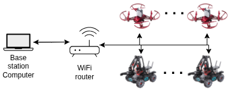

.. _overview:

Overview
========

This page explain the overview of the RoboMaster ROS 2 packages:

Explanation of packages
-----------------------

Source code is divided into several packages, each with its own purpose:

- **robomaster_interface**: This package provides the interface for controlling the RoboMaster robots and drones.
- **robomaster_ros2**: This package contains the main implementation of the RoboMaster ROS 2 node.
- **robomaster_examples**: This package includes example scripts using the RoboMaster ROS 2 node.
- **robomaster_gz**: This package provides integration with Gazebo for simulating the RoboMaster drones.

Interfaces
----------

The `robomaster_interface` package provides the interface for controlling the RoboMaster robots and drones. It includes the necessary messages, services, and actions for communication between the ROS 2 nodes and the RoboMaster devices. 

+---------------------+----------+--------------------+
| **Name**            | **Type** | **Description**    |
+=====================+==========+====================+
| GimbalAngle         | Message  | Message description for the gimbal angle of the robot. |
+---------------------+----------+--------------------+
| GimbalVel           | Message  | Message description for the gimbal velocity of the robot. |
+---------------------+----------+--------------------+
| TelloMpad           | Message  | Message description for the Tello mission pad recognition. |
+---------------------+----------+--------------------+
| AddDrone            | Service  | Service to add a drone to the system. |
+---------------------+----------+--------------------+
| AddRobot           | Service  | Service to add a robot to the system. |
+---------------------+----------+--------------------+
| RemoveRobot         | Service  | Service to remove a drone/robot from the system. |
+---------------------+----------+--------------------+
| Takeoff             | Service  | Service to command the drone to take off. |
+---------------------+----------+--------------------+ 
| SetSpeed            | Service  | Service to set the speed of the drone. |
+---------------------+----------+--------------------+
| TelloLED            | Service  | Service to control the LED of the Tello external module. |
+---------------------+----------+--------------------+
| TelloMled           | Service  | Service to control the 8x8 matrix LED of the Tello external module. |
+---------------------+----------+--------------------+
| MoveChassis         | Service  | Service to move the chassis of the robot. |
+---------------------+----------+--------------------+
| MoveArm             | Service  | Service to move the arm of the robot. |
+---------------------+----------+--------------------+
| MoveGimbal          | Service  | Service to move the gimbal of the robot. |
+---------------------+----------+--------------------+ 
| Gripper             | Service  | Service to open or close the gripper of the robot. |
+---------------------+----------+--------------------+
| RobotLED            | Service  | Service to control the LED modules of the robot. |
+---------------------+----------+--------------------+
| Fire                | Service  | Service to fire IR/gel-beans using the robots gimbal. |
+---------------------+----------+--------------------+

RoboMaster Ros 2
----------------

The `robomaster_ros2` package is the main implementation of the RoboMaster server as well as several helper nodes. It provides the core functionality for controlling the RoboMaster robots and drones, including communication with the devices, handling of messages, and execution of commands.

