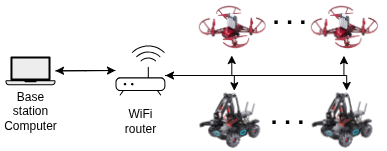

.. _overview:

Overview
========

This page explain the overview of the RoboMaster ROS 2 packages:

Explanation of packages
-----------------------

Source code is divided into several packages, each with its own purpose:

- **robomaster_interface**: This package provides the interface for controlling the RoboMaster robots and drones.
- **robomaster_ros2**: This package contains the main implementation of the RoboMaster ROS 2 node.
- **robomaster_examples**: This package includes example scripts using the RoboMaster ROS 2 node.

Interfaces
----------

The `robomaster_interface` package provides the interface for controlling the RoboMaster robots and drones. It includes the necessary messages, services, and actions for communication between the ROS 2 nodes and the RoboMaster devices.

+---------------------+----------+-------------------------------------------------------------------+
| **Name**            | **Type** | **Description**                                                   |
+=====================+==========+===================================================================+
| GimbalAngle         | Message  | Message description for the gimbal angle of the robot.            |
+---------------------+----------+-------------------------------------------------------------------+
| GimbalVel           | Message  | Message description for the gimbal velocity of the robot.         |
+---------------------+----------+-------------------------------------------------------------------+
| ArmActionStatus     | Message  | Tracked EP Core arm action state, progress, and completion.       |
+---------------------+----------+-------------------------------------------------------------------+
| ArmorHit            | Message  | Armor ID/component, water/IR type, and impact strength.           |
+---------------------+----------+-------------------------------------------------------------------+
| GripperState        | Message  | Gripper feedback, estimate, mode, busy state, and result.         |
+---------------------+----------+-------------------------------------------------------------------+
| IrHit               | Message  | Cumulative IR hit count and DJI receiver metadata.                |
+---------------------+----------+-------------------------------------------------------------------+
| TelloMpad           | Message  | Message description for the Tello mission pad recognition.        |
+---------------------+----------+-------------------------------------------------------------------+
| AddDrone            | Service  | Service to add a drone to the system.                             |
+---------------------+----------+-------------------------------------------------------------------+
| AddRobot            | Service  | Declared service; runtime handler is currently not implemented.   |
+---------------------+----------+-------------------------------------------------------------------+
| RemoveRobot         | Service  | Service to remove a drone by name/type (rmtt currently supported).|
+---------------------+----------+-------------------------------------------------------------------+
| Takeoff             | Service  | Service to command the drone to take off.                         |
+---------------------+----------+-------------------------------------------------------------------+
| SetSpeed            | Service  | Service to set the speed of the drone.                            |
+---------------------+----------+-------------------------------------------------------------------+
| TelloLED            | Service  | Service to control the LED of the Tello external module.          |
+---------------------+----------+-------------------------------------------------------------------+
| TelloMled           | Service  | Service to control the 8x8 matrix LED of the Tello external module|
+---------------------+----------+-------------------------------------------------------------------+
| MoveChassis         | Service  | Service to move the chassis of the robot.                         |
+---------------------+----------+-------------------------------------------------------------------+
| MoveArm             | Service  | Service to move the arm of the robot.                             |
+---------------------+----------+-------------------------------------------------------------------+
| MoveGimbal          | Service  | Service to move the gimbal of the robot.                          |
+---------------------+----------+-------------------------------------------------------------------+
| Gripper             | Service  | Service to open or close the gripper of the robot.                |
+---------------------+----------+-------------------------------------------------------------------+
| GripperCommand      | Service  | Open, close, pause, or endpoint-reset an EP Core gripper.         |
+---------------------+----------+-------------------------------------------------------------------+
| SetGripperMode      | Service  | Select timed or endpoint-feedback gripper control.                |
+---------------------+----------+-------------------------------------------------------------------+
| SetArmorSensitivity | Service  | Configure DJI hit sensitivity for selected armor components.      |
+---------------------+----------+-------------------------------------------------------------------+
| RobotLED            | Service  | Service to control the LED modules of the robot.                  |
+---------------------+----------+-------------------------------------------------------------------+
| GimbalLED           | Service  | Service to select and control individual gimbal armor LEDs.       |
+---------------------+----------+-------------------------------------------------------------------+
| BlasterLED          | Service  | Service to control the gimbal blaster LED.                        |
+---------------------+----------+-------------------------------------------------------------------+
| Fire                | Service  | Service to fire IR/gel-beans using the robots gimbal.             |
+---------------------+----------+-------------------------------------------------------------------+

RoboMaster ROS 2
----------------

The `robomaster_ros2` package is the main implementation of the RoboMaster server as well as several helper nodes. It provides the core functionality for controlling the RoboMaster robots and drones, including communication with the devices, handling of messages, and execution of commands.

robomaster server
^^^^^^^^^^^^^^^^^

This is the main node, handles the server type framework for the RoboMaster robots and drones. It is used to configure and manage drones/robots and handles several common services.

Topics and services provided by the server and the added robo/drone:

List of services:

+---------------------------+---------------+
| **Name**                  | **Type**      |
+===========================+===============+
| /add_drone                | AddDrone      |
+---------------------------+---------------+
| /add_robot                | AddRobot      |
+---------------------------+---------------+
| /remove_robot             | RemoveRobot   |
+---------------------------+---------------+
| /takeoff_all              | Trigger       |
+---------------------------+---------------+
| /land_all                 | Trigger       |
+---------------------------+---------------+
| /drone_1/get_sn           | Trigger       |
+---------------------------+---------------+
| /drone_1/get_battery      | Trigger       |
+---------------------------+---------------+
| /drone_1/set_speed        | SetSpeed      |
+---------------------------+---------------+
| /drone_1/takeoff          | Takeoff       |
+---------------------------+---------------+
| /drone_1/land             | Trigger       |
+---------------------------+---------------+
| /drone_1/hover            | Empty         |
+---------------------------+---------------+
| /drone_1/soft_emergency   | Trigger       |
+---------------------------+---------------+
| /drone_1/emergency        | Empty         |
+---------------------------+---------------+
| /drone_1/set_led          | TelloLED      |
+---------------------------+---------------+
| /drone_1/set_mled         | TelloMled     |
+---------------------------+---------------+
| /drone_1/status           | Trigger       |
+---------------------------+---------------+
| /drone_1/reboot           | Empty         |
+---------------------------+---------------+
| /robot_1/get_sn           | Trigger       |
+---------------------------+---------------+
| /robot_1/led_chassis      | RobotLED      |
+---------------------------+---------------+
| /robot_1/led_gimbal       | GimbalLED     |
+---------------------------+---------------+
| /robot_1/led_blaster      | BlasterLED    |
+---------------------------+---------------+
| /robot_1/move_gimbal      | MoveGimbal    |
+---------------------------+---------------+
| /robot_1/fire             | Fire          |
+---------------------------+---------------+
| /robot_1/move_arm         | MoveArm       |
+---------------------------+---------------+
| /robot_1/gripper          | Gripper       |
+---------------------------+---------------+

EP/Core/S1 robots additionally provide ``/<robot>/get_battery`` (Trigger),
``/<robot>/set_armor_sensitivity`` (SetArmorSensitivity), and armor event
topics. EP Core robots additionally provide ``move_arm_to``, ``recenter_arm``,
``reset_arm``, ``cancel_arm``, ``gripper_command``, and ``set_gripper_mode``.

List of topics (published/subscribed):

+------------------------------+-------------------+
| **Name**                     | **Type**          |
+==============================+===================+
| /drone_1/rmtt_server/pose    | Pose              |
+------------------------------+-------------------+
| /drone_1/front_tof           | Range             |
+------------------------------+-------------------+
| /drone_1/bottom_tof          | Range             |
+------------------------------+-------------------+
| /drone_1/imu                 | Imu               |
+------------------------------+-------------------+
| /drone_1/attitude            | QuaternionStamped |
+------------------------------+-------------------+
| /drone_1/baro                | FluidPressure     |
+------------------------------+-------------------+
| /drone_1/mpad                | TelloMpad         |
+------------------------------+-------------------+
| /drone_1/image               | Image             |
+------------------------------+-------------------+
| /drone_1/cmd_vel             | Twist             |
+------------------------------+-------------------+
| /drone_1/external_position   | PoseStamped       |
+------------------------------+-------------------+
| /robot_1/arm_position        | PointStamped      |
+------------------------------+-------------------+
| /robot_1/position            | PoseStamped       |
+------------------------------+-------------------+
| /robot_1/gimbal_angle        | GimbalAngle       |
+------------------------------+-------------------+
| /robot_1/gimbal_cmd_vel      | GimbalVel         |
+------------------------------+-------------------+
| /robot_1/armor_hit           | ArmorHit          |
+------------------------------+-------------------+
| /robot_1/ir_hit              | IrHit             |
+------------------------------+-------------------+
| /robot_1/gripper_state       | GripperState      |
+------------------------------+-------------------+
| /robot_1/arm_action_status   | ArmActionStatus   |
+------------------------------+-------------------+
| /robot_1/cmd_vel             | Twist             |
+------------------------------+-------------------+
